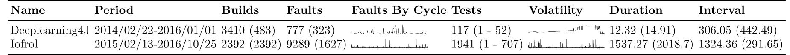

[](https://www.buymeacoffee.com/pradolima)

[](https://www.python.org/)


# TCPCI - Dataset - Utils


This tool is used to observe and extract the main information from the systems (datasets) mined using the Travis Torrent tool (from this [fork](https://github.com/jacksonpradolima/travistorrent-tools)) - or by a tool with a similar format for the results.

These systems are using Continuous Integration (CI) environments, and research on these datasets can be performed. 
For instance, we used the datasets in our prioritization algorithm named **COLEMAN** (Combinatorial vOlatiLE Multi-Armed BANdiT). For more information about **COLEMAN** please read **Ref1** in [References](#references). 


# Getting started

- [Citation](#citation)
- [Installing required dependencies](#installing-required-dependencies)
- [Datasets](#datasets)	  
    - [Deeplearning4j](#deeplearning4j)
    - [Druid](#druid)
- [About the files input](#about-the-files-input)	  
- [Using the tool](#using-the-tool)
	- [Extracting the main information](#extracting-the-main-information)
    - [Showing the information about the systems](#showing-the-information-about-the-systems)
- [References](#references)
- [Contributors](#contributors)
----------------------------------


# Citation

If this tool contributes to a project which leads to a scientific publication, I would appreciate a citation.

```

```

# Installing required dependencies

The following command allows to install the required dependencies:

```
 $ pip install -r requirements.txt
 ```

# Datasets 

The datasets used in the examples (and much more datasets) are available at [Harvard Dataverse Repository](https://dataverse.harvard.edu/dataverse/gres-ufpr). Here, we present the datasets used in this README.

## Deeplearning4j

**Deeplearning4j** is a deep learning library for Java Virtual Machine and it is available at [here](https://github.com/eclipse/deeplearning4j/tree/master/deeplearning4j). The dataset from the Deeplearning4j system is available at [here](https://doi.org/10.7910/DVN/EVR1IU), and it contains records from Travis CI build history.


## IOF/ROL

**IOF/ROL** is an industrial datasets for testing complex industrial robots from ABB Robotic. The dataset from the IOF/ROL system is available at [here](https://doi.org/10.7910/DVN/GIJ5DE), and it contains records from CI build history.

# About the files input

This tool considers two kind of files: **features-engineered.csv** and **repo-data-travis.json**. Both files contains the information about a system.

**features-engineered.csv** contains the following information:
- **Id**: unique numeric identifier of the test execution; 
- **Name**: unique numeric identifier of the test case; 
- **BuildId**: a value uniquely identifying the build; 
- **Duration**: approximated runtime of the test case;  
- **LastRun**: previous last execution of the test case as *DateTime*; 
- **NumRan**: number of executed test cases;
- **Errors**: number of errors revealed;  
- **Verdict**: test verdict of this test execution (Failed: 1, Passed: 0).

and **repo-data-travis.json** contains:
- **repository_id**: value uniquely identifying the repository.
- **build_id**: value uniquely identifying the build.
- **commit**: the commit the build is associated with.
- **pull_request**: if the build is from a pull request.
- **pull_request_number**: number of the build's pull request.
- **branch**: name of the git branch.
- **status**: current state of the build (such as passed, failed, ...).
- **duration**: wall clock time in seconds.
- **started_at**: when the build started.
- **finished_at**: when the build finished.
- **jobs**: list of jobs that are part of the build's matrix.

In our examples we have two kind of file format, in which **Deeplearning4J** contains the columns *NumRan* and *NumErrors* as well as the **repo-data-travis.json** file. 
For this kind of situation, when we process the IOF/ROL dataset we do not use the json file and we consider the faults based on the *Verdict* column. 

#  Using the tool

## Extracting the main information 

```
python data_filtering_main.py --repository "data/deeplearning4j@deeplearning4j"
```

**where:** 
- `--repository` is the complete path to the directory that constains your system. 

## Showing the information about the systems

```
python project_status_main.py --project_dir 'data' --datasets 'deeplearning4j@deeplearning4j' 'iofrol' --output_dir 'dataset_info'
```

**where:** 
- `--project_dir` is the directory that constains a system. Please, you must to inform the complete path.
- `--datasets` is an array that represents the datasets to analyse. It's the folder name inside `--project_dir` which contains the required file inputs.
- `--output_dir` is the directory where we gonna save the results.

As result, three files will be saved in `--output_dir`:

- **project_status.txt**: contains a summary about the datasets analyzed. This format is generate to be read easily by humans.
- **project_status_table.tex**: contains a summary about the datasets analyzed **without some columns** that contains graphs. This format is generate to be used in LaTeX.
- **project_status_table_complete.tex**: contains a summary about the datasets analyzed and columns that contains graphs. This format is generate to be used in LaTeX.

The output from **project_status.txt** is similar to:

```
+----------------+-----------------------+-------------+-------------+----------------+------------------+------------------+
| Name           | Period                | Builds      | Faults      | Tests          | Duration         | Interval         |
|----------------+-----------------------+-------------+-------------+----------------+------------------+------------------|
| Deeplearning4J | 2014/02/22-2016/01/01 | 3410 (483)  | 777 (323)   | 117 (1 - 52)   | 12.32 (14.91)    | 306.05 (442.49)  |
| Iofrol         | 2015/02/13-2016/10/25 | 2392 (2392) | 9289 (1627) | 1941 (1 - 707) | 1537.27 (2018.7) | 1324.36 (291.65) |
+----------------+-----------------------+-------------+-------------+----------------+------------------+------------------+
```

and the following image contains an example from **project_status_table_complete.tex** file:



Besides that, inside `--output_dir` will be save for each dataset (organized in folders) three files: 

- **failures_by_cycles.pdf**: contains a line plot about the failures by CI cycles.
- **testcase_volatility.pdf**: contains a line plot about the number of tests by CI cycles. The tests can be add or removed (discontinued) during software lifecycle. In this way, this plot show the variation of tests (test case volatility) along with the CI Cycles.
- **heatmap.pdf**: contains a heatmap plot about the test case volatility along with the CI Cycles. This plot allows to observe if a test case `returns` between CI Cycles.


# References

- 📖 [**Ref1**] [A Multi-Armed Bandit Approach for Test Case Prioritization in Continuous Integration Environments](https://doi.org/10.1109/TSE.2020.2992428) published at **IEEE Transactions on Software Engineering (TSE)**

# Contributors

- 👨‍💻 Jackson Antonio do Prado Lima <a href="mailto:jacksonpradolima@gmail.com">:e-mail:</a>
